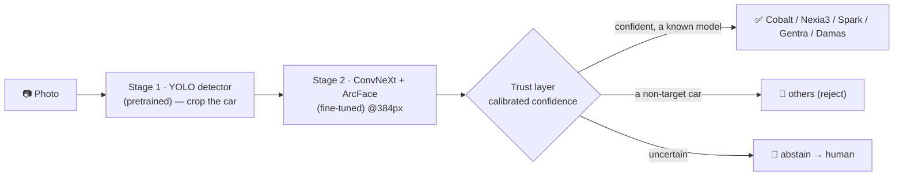

# Uzbek Car Model Recognizer

A two-stage computer-vision system that recognizes five Uzbek-market car models from a photo —
**Chevrolet Cobalt, Nexia 3, Spark, Gentra, Damas** — **rejects a car that is none of them**
(open-set recognition), and **only answers when it can hold high precision**, abstaining on the
hard cases. Built as the core of a real camera-analytics product (gas stations, car washes),
designed to scale to 20–50+ models.

> **Sealed-test result (6-class):** **0.950 accuracy · 0.936 macro-F1**, and **0.971 accuracy on
> the five known models**. Test ≈ validation (0.950 vs 0.949) — no overfitting.

---

## Why this project

There is no public tool — or dataset — that recognizes the specific cars common on Uzbekistan's
roads. Several of them are **near-identical sedans** (Cobalt / Gentra / Nexia 3), and a real
camera constantly sees **cars that aren't in the target list at all**. Both are handled here:
fine-grained separation via an angular-margin classifier, and an open-set `others` class plus
calibrated abstention so unknown cars are rejected rather than mislabeled.

## How it works



- **Stage 1 — detect & crop.** A pretrained **YOLO** detector localizes the car and crops to it
  (detection is already solved; we don't waste our data re-learning it).
- **Stage 2 — classify.** A **ConvNeXt-Tiny** backbone fine-tuned with a **sub-center ArcFace
  head at 384px** names the model. ArcFace's angular margin is what separates the look-alike
  sedans; 384px exposes the sub-pixel cues (grille, lights, badge).
- **Trust layer.** Temperature scaling makes the confidences honest; a validation-chosen
  threshold lets the system **answer only when confident on a known model**, and otherwise
  **abstain** — targeting **99% precision on the five known models** (see `notebooks/trust_layer.ipynb`).

## Results

| Model | Classes | Accuracy | Macro-F1 | Notes |
|---|---|--:|--:|---|
| Majority baseline | 6 | 0.279 | 0.073 | trivial floor |
| ConvNeXt-Tiny (v1) | 5 | 0.923 | 0.917 | first iteration |
| **ConvNeXt + ArcFace @384 (v2)** | **6** | **0.950** | **0.936** | sealed test; **0.971 on the 5 known** |

The Cobalt/Gentra/Nexia 3 look-alike confusion — v1's main weakness — collapsed to single digits
in v2. The weakest class is `others` (F1 0.789), the expected open-set difficulty. Full per-class
report and confusion matrix are in `notebooks/model_gate_v2.ipynb`.

## Repository layout

```
├── README.md                     ← you are here
├── ROADMAP.md                    end-to-end methodology, each step → its artifact
├── PROJECT_STATUS.md             living status
├── data/
│   └── README.md                 dataset provenance, counts, issue log, ethics
├── docs/
│   ├── data_collection_runbook.md   how to run the scraper
│   └── manual_review.md             the human golden-review procedure
├── scripts/
│   ├── avtoelon_scraper.py          polite, robots-compliant image scraper
│   └── deduplicate.py               hash dedup + cross-folder quarantine
├── notebooks/
│   ├── data_gate.ipynb              clean + leakage-safe split (YOLO + CLIP)
│   ├── model_gate.ipynb             v1: baselines + ConvNeXt/ResNet (5-class)
│   ├── model_gate_v2.ipynb          v2: ArcFace @384 (6-class, open-set)
│   └── trust_layer.ipynb            calibration + 99%-precision abstention
└── defense_*.md / capstone_*.md / final_action_plan.md   defense-prep docs
```

## Reproduce it

The full pipeline, with every stage mapped to its file, is in **[`ROADMAP.md`](ROADMAP.md)**. In short:

1. **Scrape** — `scripts/avtoelon_scraper.py` (see `docs/data_collection_runbook.md`).
2. **Deduplicate** — `scripts/deduplicate.py --src data/raw --dst data/dedup`.
3. **Data Gate** — `notebooks/data_gate.ipynb` → clean, leakage-safe split.
4. **Manual golden review** — `docs/manual_review.md` → 6-class `dataset_final.zip`.
5. **Model Gate v2** — `notebooks/model_gate_v2.ipynb` (Colab T4) → the trained model.
6. **Trust Layer** — `notebooks/trust_layer.ipynb` → calibrated, abstaining system.

The notebooks run on a free Google Colab **T4 GPU** and read the dataset zip from Google Drive.

## Data

The dataset was **collected and cleaned for this capstone** from public
[avtoelon.uz](https://avtoelon.uz) listings — no public Uzbek-market car dataset exists. It is
documented in **[`data/README.md`](data/README.md)** (provenance, counts, a full issue log, and
limitations). The **images themselves are git-ignored and not redistributed** — the repo
documents the method so the pipeline can be reproduced, not the data re-published.

Key data-quality guarantees:
- **Leakage-safe split by listing** — all photos of one car stay on one side of train/val/test
  (verified 0 cross-split listings).
- **Human-verified labels** — every crop was reviewed; non-target cars became the `others` class.

## Ethics & license

Images were collected from **public** listings for **academic/educational use only**. `robots.txt`
was honored, license plates are platform-masked, and the raw/cropped images are **not
redistributed** here. See `data/README.md` §5.

## Status & roadmap

Data Gate and Model Gate are complete; the Trust Layer notebook is ready to run. The production
direction (edge deployment via MobileNetV4 + INT8, embedding-distance OOD, a prototype gallery to
scale to 20–50+ models) is outlined in `ROADMAP.md` (Stage 7). Current status lives in
`PROJECT_STATUS.md`.
