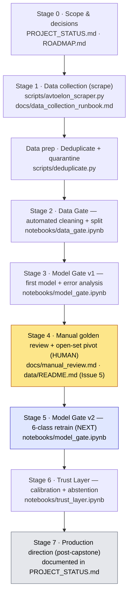

# Project Roadmap — Uzbek Car Model Recognizer

End-to-end map of the project, from an empty repo to a calibrated model — **and where
every step lives in this repository**. This is the document to walk through when
explaining the project "from 0 to end": each stage says *what*, *why*, *how*, and points
to the exact file (and notebook cells) that implements it, so the narrative and the code
never drift apart.

> **The system, in one line:** a two-stage computer-vision pipeline — a pretrained YOLO
> detector crops the car, then a fine-tuned classifier names the model — that recognizes
> five Uzbek-market cars (Cobalt, Nexia 3, Spark, Gentra, Damas), can reject an unknown
> car as a sixth **`others`** class (open-set), and only answers when it can hold high
> precision (abstaining otherwise).

---

## Pipeline at a glance

**How the manual step fits (the honest chronology):** Stages 1→2→3 are the automated
pipeline that produced a 5-class dataset and a first model. That model's **error analysis**
(Stage 3) revealed an open-set gap, which *motivated* the human review in Stage 4 — a
data-centric iteration, not an afterthought. Stage 4 is the only stage done by hand, so it
has its own written procedure (`docs/manual_review.md`) instead of a script.

---

## Stage 0 · Scope & decisions

- **What:** define the problem and lock the key design decisions.
- **Why:** a fine-grained, high-precision, open-set recognizer needs its architecture
  chosen up front — it drives every later stage.
- **Decisions made:** two-stage (detector → classifier); **fine-tune** a pretrained
  backbone rather than train from scratch; target **high precision via abstention** (not
  raw accuracy); add an **open-set `others`** class so unknown cars can be rejected.
- **In the repo:** `PROJECT_STATUS.md` (living status), this `ROADMAP.md`.

## Stage 1 · Data collection (scraping)

- **What:** collect labelled car photos from public `avtoelon.uz` listings, one subfolder
  per model.
- **Why:** no public dataset of Uzbek-market cars exists — building it is part of the
  contribution. Labels are the seller-declared make/model (a *weak* label at this point).
- **How:** a polite, browser-based scraper — bounded parallelism, rate-limited, resumable,
  `robots.txt` honored (clean listing paths + the whitelisted `?page=` pagination only).
  Filenames keep the **listing id** (`<hash>_<listingid>_<n>.jpg`) — required later for the
  leakage-safe split.
- **In the repo:** `scripts/avtoelon_scraper.py` · handoff/run instructions in
  `docs/data_collection_runbook.md`.
- **Output:** raw listing photos in per-model folders (git-ignored, not redistributed).
- **Then (data prep):** `scripts/deduplicate.py` removes exact duplicate files and
  quarantines images that appear under more than one model label (cross-folder = untrusted),
  writing a `dedup_report.csv` — the deduped set is what the Data Gate consumes.

## Stage 2 · Data Gate — automated cleaning + leakage-safe split

- **What:** turn raw listing photos into clean, model-ready crops with an honest split.
- **Why:** listing galleries mix interiors/engines/documents and the same car is reposted
  across listings — both must be removed before training or the evaluation is a lie.
- **How (→ `notebooks/data_gate.ipynb`):**
  - **Cell 3** — loads the **already-deduplicated** dataset zip from Drive + class counts.
    Deduplication (hash-based) + the cross-folder ambiguous quarantine run *before* the
    notebook, as a committed script — **`scripts/deduplicate.py`** — whose deduped output
    is what this cell consumes.
  - **Cell 4** — **YOLO11s** detector crops the car (classes car/bus/truck) and drops
    photos with no car (interiors, docs, stock images).
  - **Cell 5** — **CLIP** label cleaning: zero-shot interior detection + embedding-neighbor
    wrong-model flagging (conservative threshold).
  - **Cell 6** — **leakage-safe split by listing** (70/15/15, stratified), with a runtime
    assertion of **0 cross-split listings**.
  - **Cell 7** — back up `dataset_split.zip` to Drive.
- **Output:** **14,615 deduped → 9,525 clean** 5-class crops, split leakage-free.

## Stage 3 · Model Gate v1 — first model + error analysis

- **What:** train baselines and fine-tuned models on the 5-class data, evaluate once on a
  sealed test, and analyze the errors.
- **Why:** establish that pretraining + fine-tuning works here, pick a winner honestly, and
  — critically — *find out what the model gets wrong*.
- **How (→ `notebooks/model_gate.ipynb`):** majority baseline (Cell 5) → from-scratch CNN
  (Cell 6) → **ConvNeXt-Tiny fine-tune** (Cell 7) → ResNet-50 (Cell 8) → pick the winner on
  **validation** (Cell 9) → **sealed test, once** + confusion matrix (Cell 10) → save
  reloadable artifacts (Cells 11–12). Tracked with **MLflow**; class-weighted loss +
  **macro-F1** for imbalance.
- **Output:** ConvNeXt-Tiny at **92.3% acc / 91.7% macro-F1** on the sealed test — **and**
  the finding that the closed-set model is over-confident on non-target cars, which drives
  Stage 4.

## Stage 4 · Manual golden review + open-set pivot  ⟵ the human step

- **What:** a human verifies every crop against its folder, corrects misfiled images, and
  collects cars that are none of the five into a new **`others`** class.
- **Why:** Stage 3's error analysis showed residual wrong-model contamination and, more
  importantly, that a closed-set softmax has nowhere to put an unknown car (a BYD scored
  0.97 as `spark`). The five weak labels are upgraded to **human-verified golden**, and the
  system becomes **open-set**.
- **How:** manual eye-run over the split folders following an explicit verification rule;
  ambiguous Cobalt/Gentra/Nexia 3 sedans are **set aside, not guessed**. Only file moves —
  leakage-safety is preserved because images move *within* their existing split.
- **In the repo:** **`docs/manual_review.md`** (the full procedure, decision rule, and
  leakage re-check) · `data/README.md` **Issue 5** (the rationale in the issue log).
- **Note on traceability:** this is the one stage with **no runnable script** — it is human
  judgment. `docs/manual_review.md` exists precisely so the step is auditable and can be
  described exactly during the defense.
- **Output:** the final **6-class** dataset (`cobalt, damas, gentra, nexia3, others,
  spark`) in the identical `train/val/test` layout.

## Stage 5 · Model Gate v2 — 6-class retrain  ⟵ NEXT

- **What:** retrain on the 6-class golden dataset, with a recipe aimed at the hardest
  confusion.
- **Why:** give the model an `others` option *and* close the Cobalt/Gentra/Nexia 3
  look-alike gap that the 2026 backbone research identified as the real accuracy lever
  (the gain is in the training recipe, not a bigger backbone).
- **How (→ `notebooks/model_gate_v2.ipynb`):** a dedicated v2 notebook (v1 is kept as the
  record of the first experiment). Same discipline as v1 — baselines → approaches → pick on
  validation → sealed test once → reloadable artifacts — with the recipe upgrades: a
  **sub-center ArcFace head (K=3)**, **384px** fine-tune, fine-grained-safe label-preserving
  augmentation (RandAugment + Random Erasing, *no* vanilla MixUp/CutMix), and an **optional
  SnapMix** arm (semantic-proportion labels, off by default). It compares a plain-softmax
  @384 baseline against the ArcFace head and picks the winner on validation. Precision is
  reported on the five known models, with `others` as the reject bucket.
- **Status:** ✅ notebook built — ready to run on the 6-class dataset.

## Stage 6 · Trust Layer — calibration + abstention

- **What:** make the confidences honest and only answer above a precision-safe threshold.
- **Why:** the headline promise is **precision**, achieved by *abstaining* on the hard
  cases rather than guessing.
- **How (→ `notebooks/trust_layer.ipynb`):** **temperature scaling** (Cell 4) → find the
  **≥99%-precision threshold on validation** (Cell 5) → apply it **once** to the sealed
  test + **precision–coverage curve** (Cell 6) → reliability diagrams (Cell 7) → grid of the
  most confident mistakes (Cell 8) → save calibration into the artifact (Cell 9).
- **Open-set note:** precision is measured on the **five known models**; `others` is a
  legitimate "unknown" answer and the abstention threshold is the final safety net.

## Stage 7 · Production direction (post-capstone)

- **What:** the path from capstone to a real fixed-camera product scaling to 20–50+ models.
- **Decisions (from the 2026 backbone research):** **MobileNetV4-Conv-Medium** student
  distilled from a heavier teacher, served **INT8** via ONNX→TensorRT/OpenVINO; **embedding-
  distance OOD** (kNN / Mahalanobis) instead of a fixed softmax `others` at scale; a
  **prototype/kNN gallery** so new models are added without full retrains. Licensing guard:
  the commercial build stays on Apache/MIT backbones.
- **In the repo:** captured in `PROJECT_STATUS.md`.

---

## Stage → artifact → status

| Stage | Primary artifact(s) | Status |
|---|---|---|
| 0 · Scope & decisions | `PROJECT_STATUS.md`, `ROADMAP.md` | ✅ |
| 1 · Data collection | `scripts/avtoelon_scraper.py`, `docs/data_collection_runbook.md` | ✅ |
| 1 · Data prep — deduplicate | `scripts/deduplicate.py` | ✅ |
| 2 · Data Gate (clean + split) | `notebooks/data_gate.ipynb` | ✅ |
| 3 · Model Gate v1 (+ error analysis) | `notebooks/model_gate.ipynb` | ✅ |
| 4 · Manual golden review (open-set) | `docs/manual_review.md`, `data/README.md` (Issue 5) | ✅ |
| 5 · Model Gate v2 (6-class, ArcFace, 384px) | `notebooks/model_gate_v2.ipynb` | ✅ built · ready to run |
| 6 · Trust Layer (calibration) | `notebooks/trust_layer.ipynb` | ✅ v1 · re-run for 6-class |
| 7 · Production direction | `PROJECT_STATUS.md` | 🔭 documented |

## Known code↔step gaps (full honesty for the defense)

Every stage above is backed by a committed artifact. **One** step is intentionally not
code — the human review — and it is documented instead. Naming it explicitly so the
"narrative == repository" claim holds up under questioning:

| Step | Where it's documented | Why there's no committed code | Reproducible? |
|---|---|---|---|
| **Manual golden review + `others` class** | `docs/manual_review.md`, `data/README.md` (Issue 5) | Human judgment (an eye-run), not an algorithm | Yes — the decision rule and leakage re-check are written down; a second annotator could repeat it |

*Previously a gap, now closed:* deduplication + the cross-folder ambiguous quarantine were
originally an offline data-prep step; they are now committed as
[`scripts/deduplicate.py`](scripts/deduplicate.py), so the only non-code step left is the
human review above.

## Reproduce end-to-end

1. **Scrape** — run `scripts/avtoelon_scraper.py` (see `docs/data_collection_runbook.md`).
2. **Deduplicate** — run `scripts/deduplicate.py --src data/raw --dst data/dedup` → unique
   images + `_ambiguous/` quarantine + `dedup_report.csv`.
3. **Data Gate** — run `notebooks/data_gate.ipynb` on the deduped set → clean 5-class
   `dataset_split.zip`.
4. **Model Gate v1** — run `notebooks/model_gate.ipynb` → first model + error analysis.
5. **Manual review** — follow `docs/manual_review.md` → 6-class golden `dataset_split.zip`.
6. **Model Gate v2** — run `notebooks/model_gate_v2.ipynb` on the 6-class data (ArcFace +
   384px; optional SnapMix arm).
7. **Trust Layer** — run `notebooks/trust_layer.ipynb` → calibrated, abstaining system.

Data is documented in `data/README.md` (provenance, counts, and the issue log) but the
images themselves are git-ignored and not redistributed.
